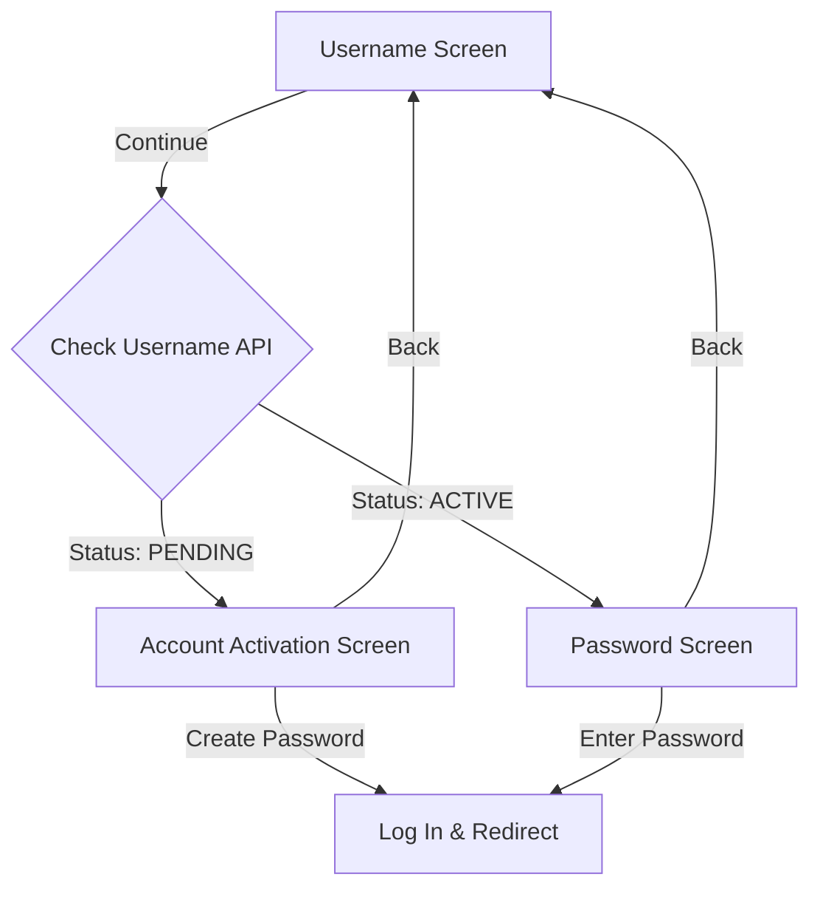

# Swasthi Life - Mobile App Functionality & User Flows (v1)

This document describes the structure, behavior, screens, and user journeys of the **Swasthi Life** mobile application. It is designed to help developers, designers, and product owners understand how the application works today.

---

## 1. Core Platform Capabilities

### 1.1 Dual-Language Support (Localization)
* **Languages:** English (`en`) and Sinhala (`si`).
* **Control:** A global `LanguageToggle` is persistent in the header of almost all screens.
* **Persistence:** The language choice is stored in `AsyncStorage` on the device. When the app is opened, it automatically loads the last selected language. If none exists, it defaults to Sinhala (`si`).

### 1.2 User Roles & Access Control
The application supports two user roles:
* **`USER` (Client):** Can fill out and submit astrology request forms (Hadahan and Porondam).
* **`ADMIN` (Manager):** Can review submitted requests, update their status, write notes, and view a requests dashboard.

---

## 2. User Authentication Flows

The login flow is dynamic and changes depending on the account status checked from the backend.

### 2.1 Username Verification Screen (Step 1)
* **Objective:** Verify if the user's username exists in the system database.
* **Fields:** A single input field for **Username**.
* **Action:** 
  * Tap **Continue** to query the server.
  * If the username is valid:
    * If `account_status` is `PENDING`, the user proceeds to the **Account Activation Screen**.
    * If `account_status` is `ACTIVE`, the user proceeds to the **Password Screen**.
  * If the username is invalid, an error alert is displayed.

### 2.2 Account Activation Screen (Step 2 - New Users)
* **Objective:** Allow new users with pending accounts to set up their password.
* **Fields:** 
  * **Password** (masked input)
  * **Confirm Password** (masked input)
* **Actions:**
  * **Create Password:** Saves the password in the database and automatically logs the user in.
  * **Back:** Returns the user to the Username Verification Screen to correct a typo.

### 2.3 Password Entry Screen (Step 2 - Existing Users)
* **Objective:** Authenticate registered users.
* **Fields:** 
  * **Password** (masked input)
* **Actions:**
  * **Log In:** Submits the password to retrieve a JWT session token and direct the user to their portal.
  * **Back:** Returns the user to the Username Verification Screen.

---

## 3. Regular User Portal (Client Journeys)

Once logged in as a regular `USER`, the client enters the **Home Screen** welcoming them by name.

### 3.1 Home Screen Grid
Users are presented with 4 main action cards:
1. **Fill Hadahan Form**
2. **Fill Porondam Form**
3. **Settings**
4. **App Info**
* *A logout option is displayed at the bottom of the home screen to clear the session and return to authentication.*

### 3.2 Hadahan Form Flow (Horoscope Generation)
Used to submit information required to generate a personalized horoscope.
* **Input Fields:**
  * **Full Name** (Single-line text)
  * **Address** (Multi-line text)
  * **Contact Number** (Single-line text)
  * **Additional Contact Number** (Optional, single-line text)
  * **Date of Birth** (Single-line text)
  * **Time of Birth** (Single-line text)
  * **Place of Birth** (Single-line text)
  * **Additional Notes** (Optional, multi-line text)
* **Actions:**
  * **Submit:** Validates fields and registers the form. Shows a success alert displaying the unique **Request Number** generated by the server, then redirects back to the Home Screen.
  * **Back:** Aborts form filling and returns to the Home Screen.

### 3.3 Porondam Form Flow (Horoscope Matching)
Used to submit details for two individuals to calculate compatibility metrics.
* **Input Fields:**
  * **Contact Person / Girl Name** (Single-line text)
  * **Address** (Multi-line text)
  * **Contact Number** (Single-line text)
  * **Additional Contact Number** (Optional, single-line text)
  * **Date of Birth** (Single-line text)
  * **Time of Birth** (Single-line text)
  * **Place of Birth** (Single-line text)
  * **Boy Name** (Optional, multi-line text)
* **Actions:**
  * **Submit:** Transmits details to the backend. Shows a success alert displaying the generated **Request Number**, then redirects back to the Home Screen.
  * **Back:** Aborts form filling and returns to the Home Screen.

### 3.4 Settings & App Info
* **Settings:** Shows the current user configuration and a log-out option.
* **App Info:** Displays developer/app credentials and the Swasthi Life platform overview text.

---

## 4. Admin Portal (Management Journeys)

Users authenticated with the `ADMIN` role are directed to the **Admin Portal**. It is structured with a bottom navigation bar containing 3 tabs to switch between request management, analytics, and service forms.

### 4.1 Admin Push Notifications
* When an Admin logs in, the app automatically registers their device's Expo push notification token.
* If a new request is submitted, the admin receives a push notification.
* Tapping the notification opens the app and redirects the admin directly to the requests management tab.

### 4.2 Requests Management Tab
Displays a scrollable list of all submitted forms (Hadahan and Porondam) in real-time.
* **Request Cards:** Each card displays:
  * **Request Number** (Unique ID)
  * **Form Type & Source** (e.g. `HADAHAN - MOBILE` or `PORONDAM - GUEST-WEB`)
  * **Submission Date and Time**
  * **Status** (e.g., `NEW`, `ON_HOLD`, `DONE`, `CANCELLED`)
  * **Admin Note Input** (Multi-line field)
* **Status Action Controls:**
  * **Done:** Marks the request as completed.
  * **On Hold:** Places the request on pause. *Requires writing an Admin Note first.*
  * **Cancel:** Cancels the request. *Requires writing an Admin Note first.*

### 4.3 Dashboard Analytics Tab
Provides a high-level summary of request statistics. It displays a grid of cards showing:
* **Total:** Total number of requests in the system.
* **New:** Requests currently awaiting review.
* **On Hold:** Requests currently placed on hold.
* **Done:** Completed requests.

### 4.4 Menu / Settings Tab
Allows the admin to access user-facing features and settings directly. It displays the same action grid as the regular user:
* **Fill Hadahan Form:** Fills and submits a new Hadahan form.
* **Fill Porondam Form:** Fills and submits a new Porondam form.
* **Settings:** Displays current configuration.
* **App Info:** Displays app information.
* **Log Out:** Logs out the admin and returns them to the login screen.

*Note: When an Admin opens any form, Settings, or App Info, clicking the **Back** button or successfully submitting a form will dynamically route them back to the Admin Portal (`admin` screen).*
